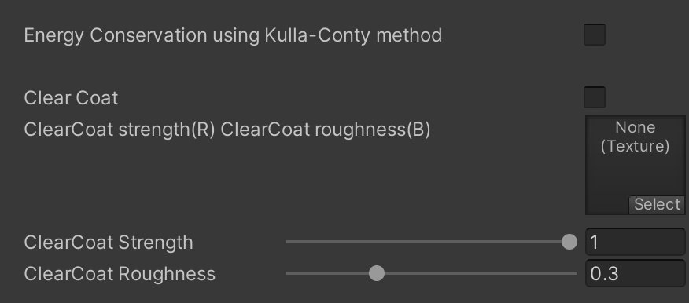
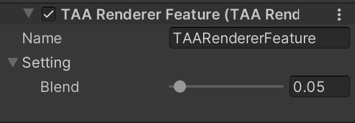
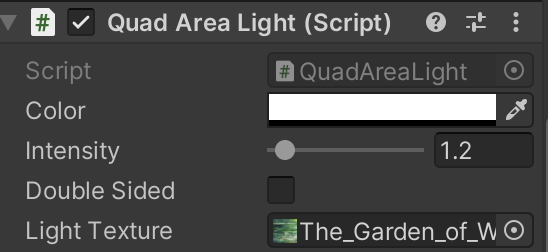
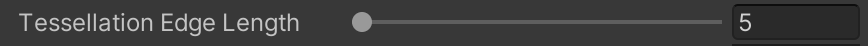
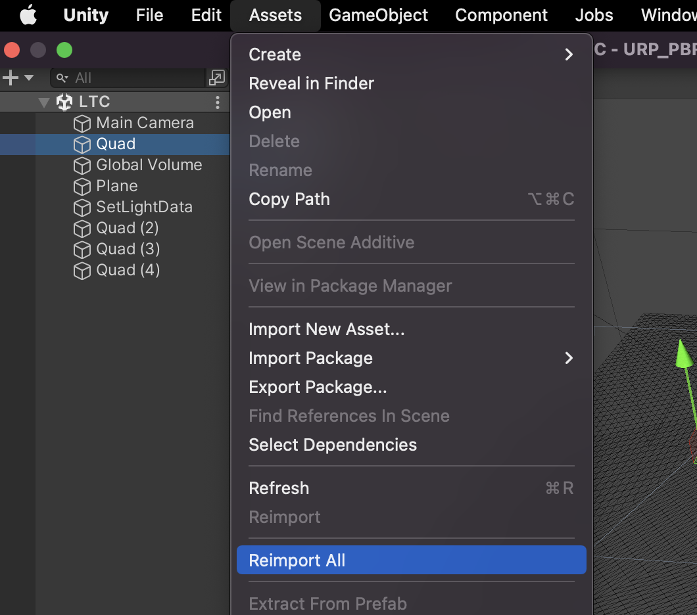

# PBR for Unity's Universal Render Pipeline

## This project implements:
-  **Standard material (with clear coat and energy compensation)**             
-  **Anisotropy material**         
-  **Cloth material**             
-  **Temporal antialiasing (TAA)**    
-  **Area light using Linearly Transformed Cosines**      
-  **Parallax Occlusion Mapping**      
-  **Tessellation (with Displacement Map)**

## Results
**Standard, Clear coat, Anisotropy, Cloth materials**

**Area light**

**TAA**

**Tessellation**

## Requirements
- Unity 2021.3 LTS or higher.

## Instruction
- To use materials, just create new material with corresponding shader(Lit/Anisotropy/Cloth).
- To enable clear coat or energy compensation, enable corresponding checkbox.

- To enable TAA, enable the RendererFeature "TAA".

- To use area light, add a "Quad Area Light" script to a quad.

- To enable tessellation, modify following item in material property.
- 

## Known Issue
If you can't load the Unity project properly, try **[Assets/Reimport All]**.

