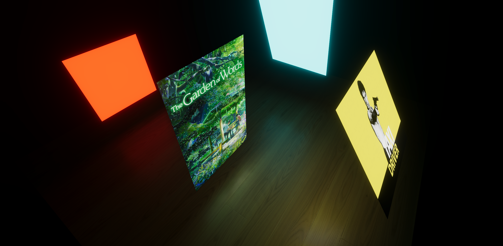
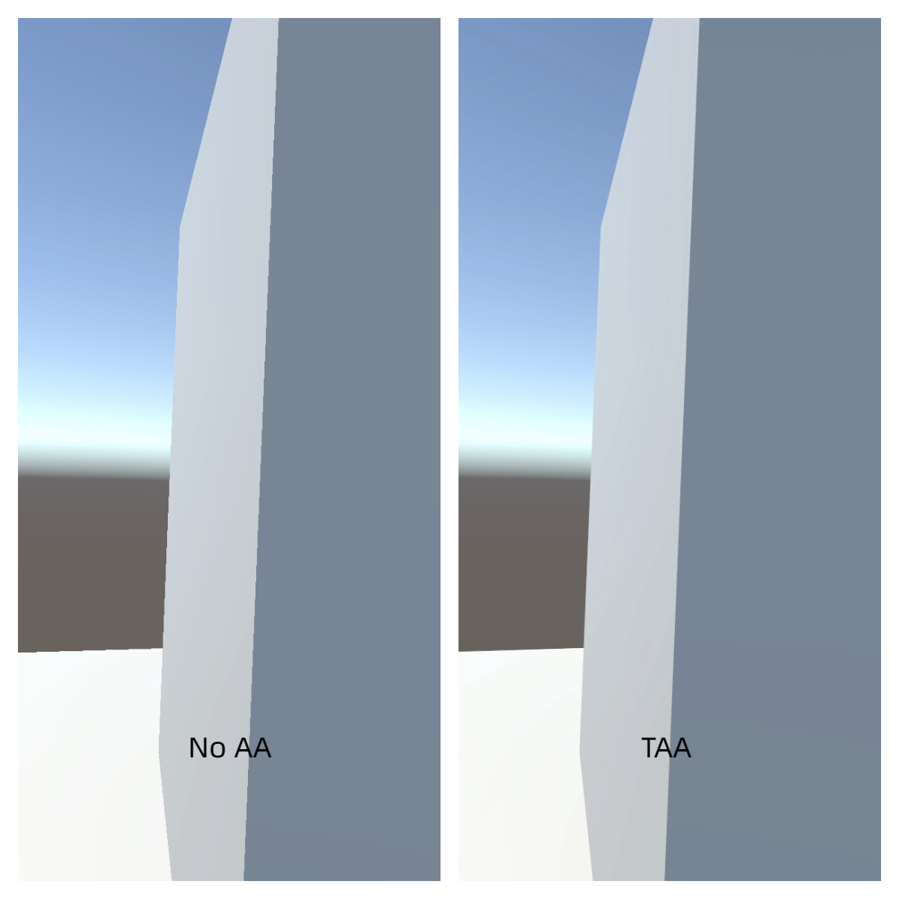
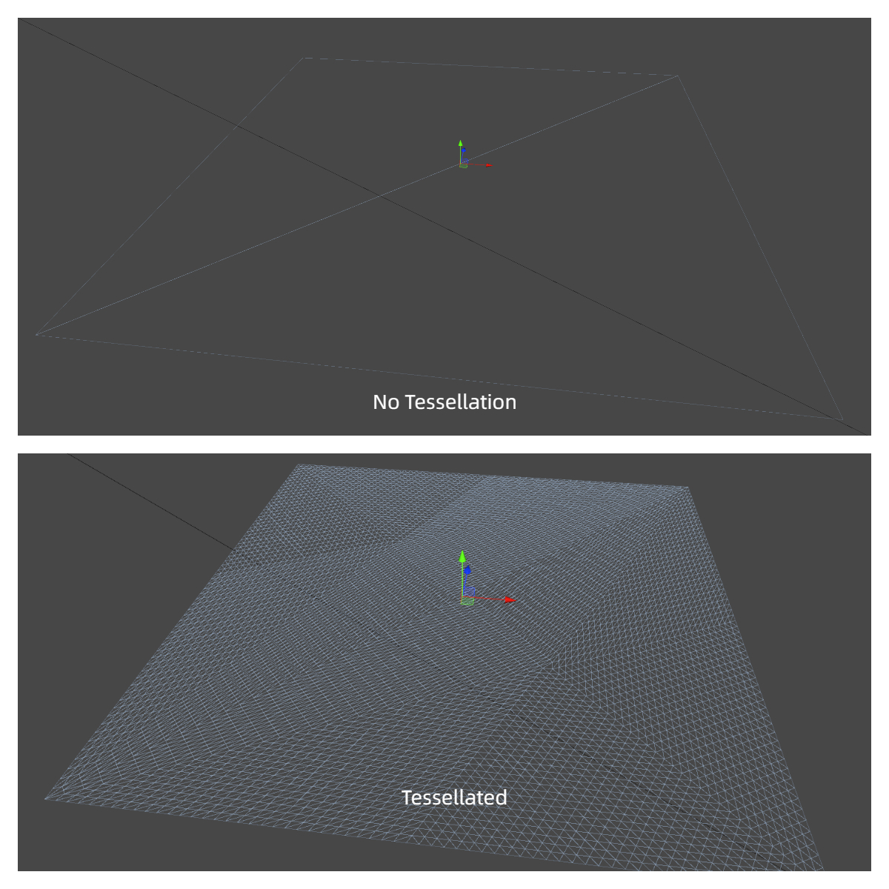

#### 介绍
Unity URP管线下的PBR实现 

Unity 版本： **Unity 2021.3 LTS**   

本项目所实现的内容：

-  **标准材质**             :white_check_mark:  
-  **清漆**                :white_check_mark:   
-  **各向异性**             :white_check_mark:   
-  **布料**                :white_check_mark:   
-  **时间性抗锯齿(TAA)**    :white_check_mark:   
-  **实时多边形面光源(LTC)**        :white_check_mark:   
-  **视差贴图(Parallax Occlusion Mapping)**       :white_check_mark:   
-  **曲面细分(用于Displacement Map)**        :white_check_mark:   

**标准、清漆、各向异性、布料材质**

**实时面光源**

**TAA**

**动态曲面细分**
